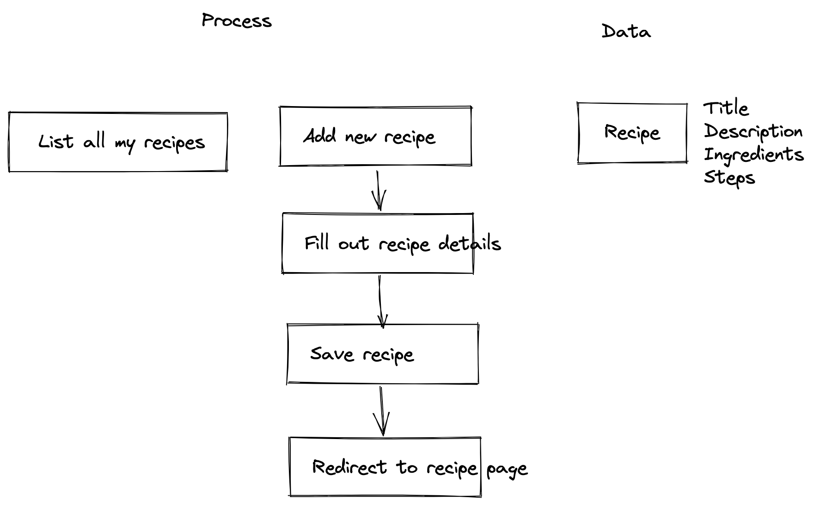

# Simple Recipe

## Workflow

1. Problem Statement / Specification / Abstract
   - Users / Customers
   - Subject Matter Expert
2. Solution or Competition Research
   - Inspiration
3. User Experience or Business Process / Flow or Idea Solution
   - User Research
   - Validate the Idea / Solution

## Details

### Problem

I want a simple recipe app. Because it's hard to organize recipes that I cook everyday. And most of the solutions are too complicated.

### Competition/Alternative

- Cookpad
- Epicurious
- YouTube

### Features/Limitations

- No need to register/login
- App can work offline
- Add new recipe
- List all my recipes

### Process and Data

